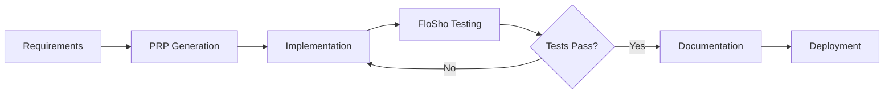

# xText-PRP + FloSho 🌊
## Context Engineering Framework with Visual Testing & Documentation

**Created by Gregory Reeves, Inkwell Technology Studios**  
**Enhanced with FloSho Visual Testing**

> "Context engineering is the delicate art and science of filling the context window with just the right information for the next step." - Andrej Karpathy

This enhanced framework combines xText-PRP's context engineering with FloSho's visual testing to ensure every feature is not just implemented, but proven to work through automated testing with screenshot documentation.

## 🎯 Core Philosophy

**Context Engineering + Visual Verification = Confidence**

We now provide:
- Complete and structured context (xText-PRP)
- Visual testing with screenshots (FloSho)
- Automatic user documentation generation
- Self-validating implementations
- Professional deliverables

## 🌊 What's New: FloSho Integration

FloSho adds mandatory visual testing that transforms tests into documentation:
- **📸 Screenshot Every State**: Capture before/after for all interactions
- **📖 Auto-Generated Docs**: Tests become user manuals automatically
- **🔌 API Visualization**: See requests/responses as images
- **✅ Quality Gates**: No feature is complete without passing tests

## 📁 Enhanced Structure

```
xText-PRP/
├── .claude/                    # Claude-specific configurations
│   ├── CLAUDE.md              # Global AI assistant rules
│   ├── CLAUDE_FLOSHO.md       # FloSho testing rules
│   └── commands/              # Context commands
├── PRPs/                      # Product Requirements Prompts
│   ├── templates/             
│   │   ├── basic-prp.md      # Standard PRP template
│   │   └── flosho-prp.md     # PRP with FloSho tests
│   └── examples/              
├── context/                   # Dynamic context management
│   ├── project-init.md        
│   ├── architecture.md        
│   ├── implementation.md      
│   ├── testing.md             # FloSho testing context
│   └── deployment.md          
├── testing/                   # FloSho framework
│   └── flosho/               
│       ├── index.js          # Core FloSho class
│       ├── cli.js            # CLI tool
│       └── run.js            # Test runner
└── INITIAL.md                 
```

## 🚀 Quick Start

1. **Initialize a new project:**
   ```bash
   # Clone the enhanced template
   git clone https://github.com/a2thalex/xText-PRP.git your-project
   cd your-project
   
   # Install dependencies
   npm install
   npx playwright install chromium
   
   # Open with Claude Code
   claude-code .
   ```

2. **Provide your app idea:**
   ```
   "I want to build a [TYPE] app that [DESCRIPTION]"
   ```

3. **Claude Code will now:**
   - Analyze requirements (xText-PRP)
   - Generate comprehensive PRP
   - Implement features
   - **Test with FloSho** (NEW!)
   - **Generate visual documentation** (NEW!)
   - Deploy with confidence

## 🧪 FloSho Testing Workflow

### Example: Testing a Login Feature

```javascript
import { FloSho } from './testing/flosho/index.js';

const flosho = new FloSho('User Authentication');
await flosho.init();

// Test the login flow
await flosho.flow('Login Process', [
  {
    action: 'navigate',
    url: '/login',
    description: 'Navigate to login page'
  },
  {
    action: 'fill',
    selector: '#email',
    value: 'user@example.com',
    description: 'Enter email address'
  },
  {
    action: 'fill',
    selector: '#password',
    value: 'password123',
    description: 'Enter password'
  },
  {
    action: 'click',
    selector: '#submit',
    description: 'Click login button'
  },
  {
    action: 'wait',
    selector: '.dashboard',
    description: 'Wait for dashboard to load'
  }
]);

// Test the API
await flosho.api('/api/auth/login', [
  {
    name: 'Valid login',
    method: 'POST',
    data: { email: 'user@example.com', password: 'password123' },
    expect: { status: 200 }
  }
]);

await flosho.done(); // Generates documentation
```

### Generated Output

```
testing/flosho-docs/
├── screenshots/              # Every state captured
│   ├── login-step1-before.png
│   ├── login-step1-after.png
│   └── ...
├── user-manual/             # Auto-generated docs
│   ├── README.md           # Complete guide
│   └── login-process.md    # Step-by-step with screenshots
├── api-flows/              # Visual API documentation
│   └── api-valid-login.png
└── videos/                 # Screen recordings
    └── login-process.webm
```

## 📋 Enhanced Components

### 1. Product Requirements Prompt (PRP) + Tests
PRPs now include:
- Original PRP content
- **FloSho test scenarios**
- **Visual acceptance criteria**
- **Screenshot requirements**

### 2. Automated Documentation
- User flows become user guides
- Screenshots provide visual proof
- API calls are visualized
- No manual documentation needed

### 3. Quality Assurance
- Every feature must have tests
- Tests must pass before completion
- Visual evidence required
- Regression prevention built-in

## 🔧 Commands

```bash
# Test a specific flow
npm run test:flow "Feature Name"

# Test APIs
npm run test:api

# Auto-detect and test
npm run test:auto

# View documentation
npm run docs

# Run FloSho CLI
npm run flosho test "My Feature"
```

## 💡 Best Practices

### From xText-PRP:
1. **Be Specific**: Provide detailed context
2. **Use Examples**: Include desired behavior
3. **Define Constraints**: Specify limitations
4. **Iterate**: Use validation loops

### From FloSho:
5. **Test Everything**: No untested features
6. **Capture States**: Screenshot before/after
7. **Document Visually**: Let screenshots tell the story
8. **Verify APIs**: Visual request/response

## 📊 Example Project Flow



## 🎯 Benefits

1. **Complete Confidence**: Visual proof everything works
2. **Automatic Documentation**: Tests generate user guides
3. **Quality Built-in**: Can't skip testing
4. **Professional Output**: Ready for stakeholders
5. **Time Savings**: Documentation happens automatically

## 📚 Based On

- **Andrej Karpathy's** Software 3.0 vision
- **Tobi Lütke's** context engineering principles
- **Playwright** for browser automation
- **Modern DevOps** practices

## 🤝 Contributing

Help us improve:
- Enhanced PRP templates
- More FloSho test patterns
- Domain-specific examples
- Bug reports and features

## 📄 License

MIT License - Use freely in your projects

---

**xText-PRP + FloSho** - Context + Testing = Confidence

*"Most agent failures are not model failures anymore, they are context failures. FloSho ensures your context leads to success."*

Start building better apps with better context and visual proof. 🚀🌊